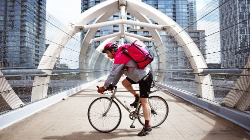
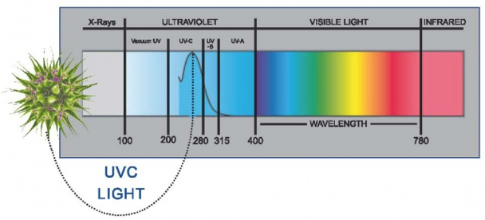
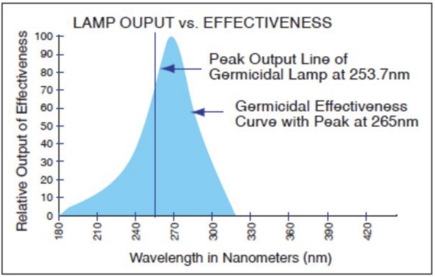
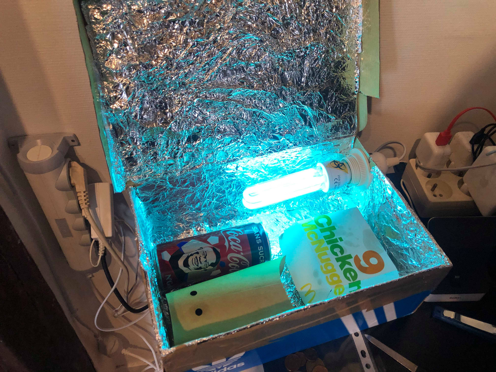
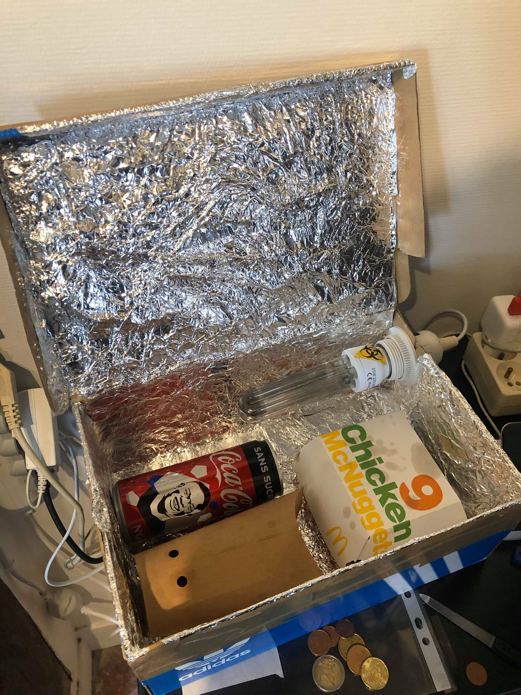
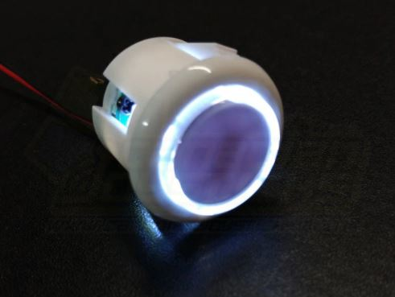
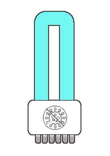
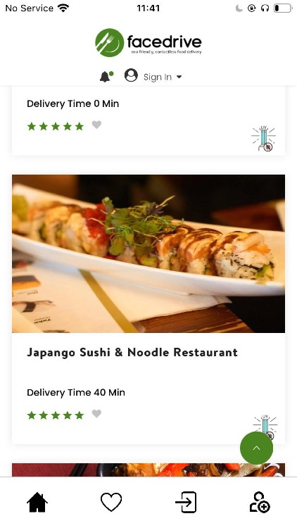
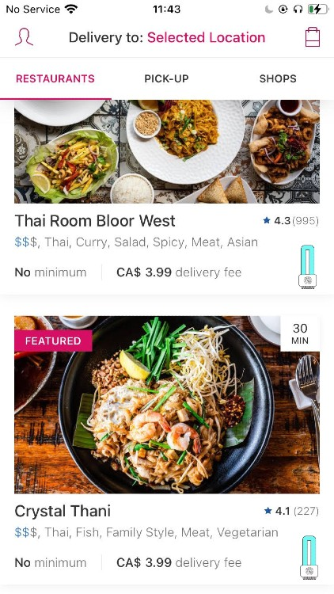
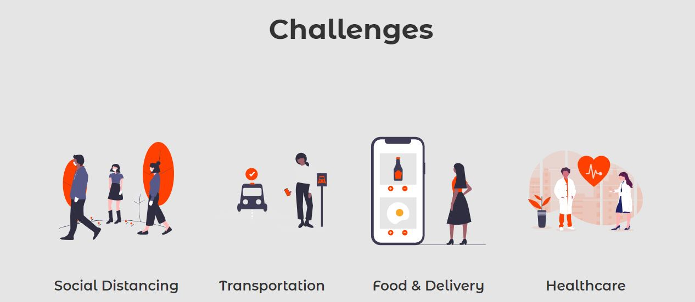

# Low Cost, Highly Portable, Food Delivery Sanitizer

## Description

### Overview
Our proposal is a low cost, portable attachment to any food delivery service bag that floods the bag with safe, viracidal light.

### Viracidal Effectiveness of UV-C Light

The range of wavelengths that effectively kill viruses and germs is 100-280nm, known as UV-C.

This wavelengthis absorbed by the DNA and RNA of microscopic organisms like Corona viruses, which alters the structure of them, eliminating their ability to replicate. This is also known as Ultraviolet Germicidal Irradiation.
[Clordisys research on UV-C Effectiveness](https://www.clordisys.com/pdfs/misc/UV%20Data%20Sheet.pdf)

## Proudct Images

### Product Assembly

#### Buttons
* LED light included for style and safety for delivery driver to know if light is on or off. This can be sewed into the bag near the zipper opening.

* CAD $4.99
[Website Link](https://www.canadianjoysticks.com/qanba-24mm-led-button-white-body-white-led/)

## User Experience

### App Integration

#### Iconography
Option 1:

Option 2:

#### In App Icon
* Facedrive Integration with Icon 1: 

* Foodora Integration with Icon 2:

### Video on safe package handling
[Link](https://www.youtube.com/watch?v=Sryj2VsuKns)

<!-- https://wdrfree.com/stock-vector/disinfection-lamp-icon-->

### Benefits

#### Clean
UV-C Viracidal Irradiation doesn't require airflow or sealed containers to effectively neutralize viral contaminents. It also leaves no harmful residue that has to be cleaned after decontamination,

#### Environemtally Friendly
No toxic chemicals are created by these UV-C lamps and disposal doesn't require special handling. The light doesn't contaminate the air or water so there are no environmentally harmful byproducts of using UV-C for decontamination.

#### Safe
UV-C light is safely observable by a user if it is done through a transparent plastic. Therefore, an optional transparent plastic square could be added to delivery bags for users who want to be able to observe the packages and light during operation. UV-C light will not pass through most plastics and glass, as well as many other materials.

#### Fast
Decontamination takes 10-15 minutes to be fully effective. This is extremely convenient as that is about the average time that deliveries take, so a driver can simply turn on the light when they collect the food and forget it until they arrive at their place of delivery. There is no harm from extended periods of exposure (like 1 hour).

According to the [UberEats Delivery Information page](https://www.ubereats.com/restaurant/en-US/faq): 
> "On average, our driver partners deliver within 15 minutes (from pickup to dropoff)**"
> -UberEats Website

#### Simple
The decontamination processs is easy to understand. Anything the light touches is being disinfected. Drivers can easily imagine where on the package the most effective decontamination will occur.

#### Short Range
UV-C decontamination effectiveness experiences exponential decay over distance. The effective range is 2 meters. This makes it a perfect solution for the close ranges of a food delivery package, which also often has reflective insulating material inside of it, which could help aid decontamination in nooks and crannies of the packaging.

#### Cost effective
The cost of a typical bulb is $25.

#### Long Lasting
These bulbs can last for 1000's of hours at max output. Even if we assume the delivery driver uses the add-on 10 hours per day, they can work 100 days per bulb.

# Competition Information
[Virtual Hacks](https://virtualhacks.ca/)

#### What must the final solution include?
* Text Description: The text description should explain the features and functionality of your Application and/or a step by step walkthrough of the application / idea. 

* Images: The image(s) should be photographs or screenshots of your working Application.

* Video/Presentation: The video portion of the Submission: a. should be less than five (5) minutes; b. must include footage that clearly explains the Application’s features and functionality through a comprehensive demonstration;

* Additional information: Background of the idea conception, who is on the team, the problem statement and which sector the solution applies to (Health, Transportation, etc) and a value proposition. 
